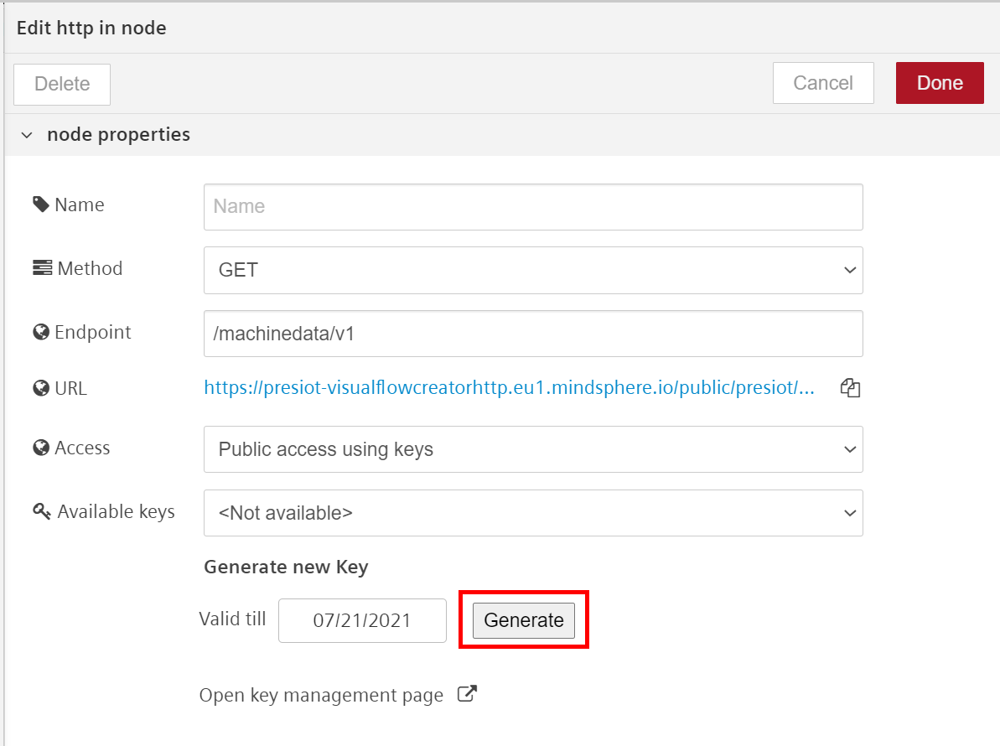
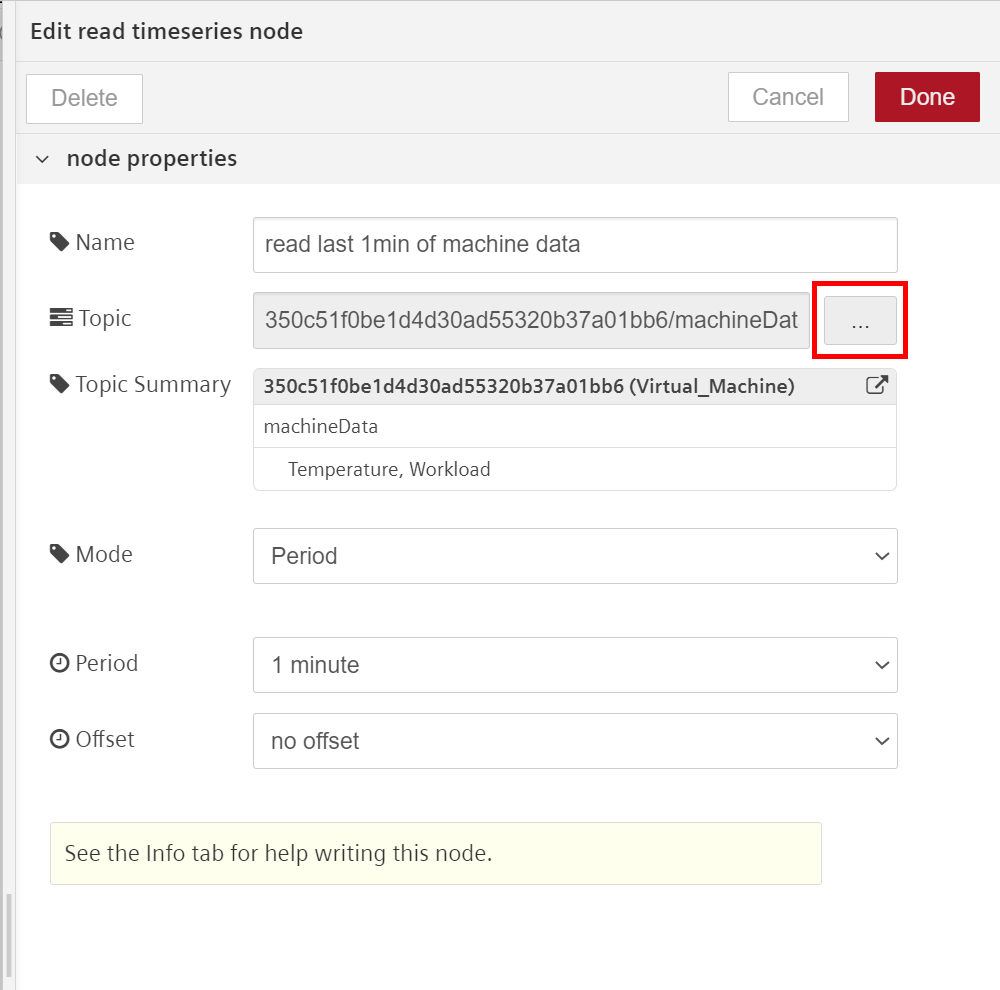

# Create a custom API endpoint

If you want to provide some external partners/users with your MindSphere data though a customizable API endpoint, this is how you get started on this. 
The example shows how you can 
- specify a dedicated MindSphere RestAPI endpoint
- select the method the endpoint should support (GET, PUT, POST, DELETE)
- choose who has access to this endpoint (only users of the flow, all users on the tenant, public access)
- develop the API functionality using VFC nodes

This flow demonstrates a simple getting-started example on how to provide machine data via an API for external access of the last 15min intervall of machine data as JSON object. 

# How to

1. Import the flow in Visual Flow Creator
2. Setup the API endpoint in the HTTP-IN node (blue node)
    - enter you custom endpoint-URL
    - choose endpoint access
    - generate key in case of public API access
    - the URL shown in the node setup is the direct URL to access the service
    
3. Selet an Asset / Aspect / Variable(s) where you want to read the time series data from (yellow node)

4.  Save the flow 

:cloud: :heavy_check_mark: You're ready to access the service via the URL shown in the *HTTP IN* node - enjoy!

